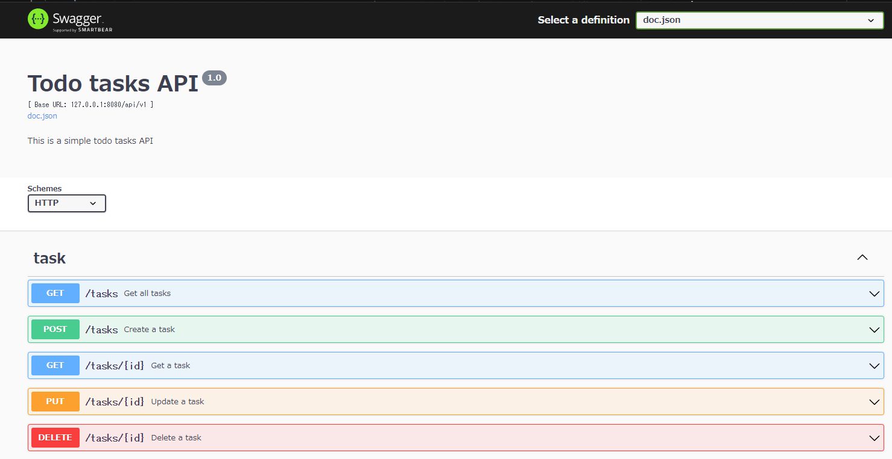
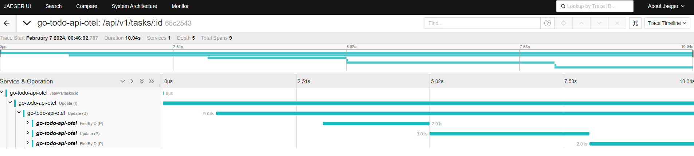

# go-todo-api-otel

[](https://go.dev)
[](https://code.visualstudio.com/)
[](https://www.gnu.org/licenses/agpl-3.0.en.html)
[](https://wakatime.com/@Domao/projects/kqtflqupad)

PoC of OpenTelemetry for go echo api

## Endpoints



## Tracing examples



## Commands

### Run this example
```bash
git clone https://github.com/Dosugamea/go-todo-api-otel
cd go-todo-api-otel
docker-compose up -d
```

- Open your browser
- Insert some tasks
  - http://localhost:8080/swagger/index.html#/task/create-task
- Update the created task
  - http://localhost:8080/swagger/index.html#/task/update-task
- See the open telemetry dashboard and the logging is working correctly
  - http://localhost:16686/search

### Regenerate docs
```bash
swag init
```

### Required environment variables
```bash
$env:EXPORTER_ENDPOINT = "localhost:4317"
```

## References
- DDD
  - https://github.com/gs1068/golang-ddd-sample
- Echo
  - https://zenn.dev/nrikiji/articles/32748c274238ad
  - https://github.com/nrikiji/go-echo-sample
  - https://github.com/xesina/golang-echo-realworld-example-app
- Swagger
  - https://ken-aio.github.io/post/2019/02/05/golang-echo-swagger/
- OpenTelemetry
  - https://christina04.hatenablog.com/entry/opentelemetry-in-go
  - https://zenn.dev/avita_blog/articles/d1fb4afd200aa1
  - https://uptrace.dev/get/opentelemetry-go.html
  - https://blog.cybozu.io/entry/2023/04/12/170000
  - https://gammalab.net/blog/43uqjmpr8qx/
  - https://uptrace.dev/get/instrument/opentelemetry-gorm.html